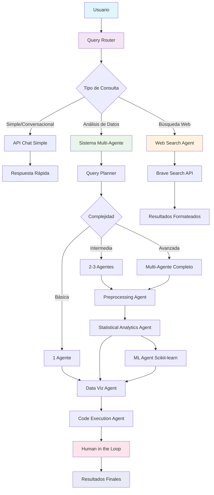

# DSAgency - Plataforma de Análisis de Datos con IA

DSAgency es una plataforma integral de análisis de datos que utiliza inteligencia artificial para automatizar flujos de trabajo de ciencia de datos. La plataforma soporta múltiples proveedores de IA, búsqueda web, asistente de voz, ejecución automática de código Python y un sistema multi-agente avanzado.

## 🚀 Características Principales

### 🤖 Múltiples Proveedores de IA
- **OpenAI**: GPT-4o, GPT-4o-mini
- **Claude (Anthropic)**: claude-3-7-sonnet-20250219, claude-3-5-sonnet-20241022, claude-3-haiku-20240307
- **Google Gemini**: gemini-2-5-flash, gemini-2-5-pro
- **Mistral AI**: mistral-large, mistral-medium, mistral-small
- **Cohere**: command, command-light, command-r, command-r-plus
- **Groq**: llama3-70b-8192, llama3-8b-8192, mixtral-8x7b
- **Ollama** (Local): llama3, llama2, mistral, phi3, orca-mini

### 📊 Análisis de Datos Avanzado
- **Carga de Datos**: Importación desde múltiples fuentes (CSV, Excel, JSON)
- **Análisis Exploratorio**: Generación automática de estadísticas descriptivas
- **Visualizaciones**: Creación automática de gráficos con Plotly, matplotlib y seaborn
- **Ejecución de Código**: Interpretación y ejecución automática de código Python
- **Insights Inteligentes**: Generación de conclusiones y recomendaciones
- **Sistema Multi-Agente**: Coordinación inteligente de agentes especializados

### 🌐 Búsqueda Web Integrada
- Búsqueda web en tiempo real usando **Brave Search API**
- Detección automática de idioma (español/inglés)
- Integración directa en el chat
- Resultados formateados y contextualizados
- Fallback inteligente al AI cuando no hay API key

### 🎤 Asistente de Voz
- Reconocimiento de voz en tiempo real
- Comandos de búsqueda web por voz
- Interacción natural con los agentes

### 🔧 Sistema Multi-Agente Inteligente
- **Routing Automático**: Detección inteligente del tipo de consulta
- **Ejecución Condicional**: Control preciso sobre cuándo ejecutar código
- **Agentes Especializados**: Cada agente tiene una función específica
- **Coordinación Optimizada**: Uso mínimo de agentes para máxima eficiencia

### 🛠️ Sistema "Human in the Loop"
- **Editor de Código Interactivo**: Edita código antes de ejecutar
- **Validación en Tiempo Real**: Detecta errores mientras escribes
- **Auto-corrección**: Corrige problemas comunes automáticamente
- **Control Total**: El usuario decide qué código ejecutar

## 🏗️ Arquitectura del Sistema

```
DSAgency/
├── backend/                    # Servidor FastAPI
│   ├── agents/                # Agentes de IA especializados
│   │   ├── agents.py         # Sistema multi-agente principal
│   │   ├── web_search_agent.py # Agente de búsqueda web
│   │   ├── code_execution_agent.py # Agente de ejecución de código
│   │   └── memory_agents.py  # Agente de memoria
│   ├── api/                  # Endpoints de la API
│   │   ├── chat_routes.py    # Rutas de chat y conversación
│   │   ├── analytics_routes.py # Rutas de análisis
│   │   ├── upload_routes.py  # Rutas de carga de archivos
│   │   └── model_routes.py   # Rutas de gestión de modelos
│   ├── managers/             # Gestores del sistema
│   │   ├── ai_manager.py     # Gestor de IA
│   │   └── session_manager.py # Gestor de sesiones
│   ├── config/               # Configuración
│   ├── utils/                # Utilidades
│   └── main.py              # Punto de entrada del backend
├── frontend/                 # Aplicación React
│   ├── src/
│   │   ├── components/       # Componentes React
│   │   ├── pages/           # Páginas de la aplicación
│   │   ├── services/        # Servicios de API
│   │   └── utils/           # Utilidades del frontend
│   ├── static/              # Archivos estáticos
│   └── public/              # Recursos públicos
├── uploads/                 # Directorio de archivos subidos
├── docker-compose.yml       # Configuración de Docker
└── README.md               # Este archivo
```

## 🤖 Sistema Multi-Agente y Flujo de Trabajo

DSAgency utiliza un sistema multi-agente inteligente que coordina diferentes especialistas para proporcionar análisis de datos completos.



### 🎯 Agentes Especializados

#### 1. **Query Router & Planner** 🎯
- **Función**: Analiza consultas y determina el flujo óptimo
- **Routing Inteligente**: 
  - Consultas simples → `/api/chat/simple` (4s respuesta)
  - Análisis de datos → Sistema multi-agente
  - Búsqueda web → Brave Search API
- **Tipos de Plan**:
  - **Básico**: Un solo agente (ej: solo visualización)
  - **Intermedio**: 2-3 agentes (ej: limpieza + análisis + visualización)
  - **Avanzado**: Flujo completo multi-agente

#### 2. **Preprocessing Agent** 🧹
- **Función**: Limpieza y preparación de datos
- **Capacidades**:
  - Manejo de valores faltantes
  - Conversión de tipos de datos
  - Detección y corrección de inconsistencias
  - Normalización de fechas y formatos
- **Herramientas**: Pandas, NumPy
- **Salida**: DataFrame limpio y preparado

#### 3. **Statistical Analytics Agent** 📈
- **Función**: Análisis estadístico avanzado
- **Capacidades**:
  - Regresión lineal y múltiple
  - Análisis de series temporales
  - Descomposición estacional
  - Pruebas de hipótesis
  - Análisis de correlaciones
- **Herramientas**: Statsmodels, SciPy
- **Salida**: Modelos estadísticos y métricas

#### 4. **ML Agent (Scikit-learn)** 🤖
- **Función**: Aprendizaje automático y modelado predictivo
- **Capacidades**:
  - Clasificación y regresión
  - Clustering y reducción de dimensionalidad
  - Validación cruzada y métricas de evaluación
  - Feature importance y selección
- **Herramientas**: Scikit-learn, XGBoost
- **Salida**: Modelos entrenados y evaluaciones

#### 5. **Data Visualization Agent** 📊
- **Función**: Creación de visualizaciones interactivas
- **Capacidades**:
  - Gráficos estadísticos (histogramas, box plots, scatter plots)
  - Visualizaciones de series temporales
  - Mapas de calor y matrices de correlación
  - Dashboards interactivos
- **Herramientas**: Plotly, Matplotlib, Seaborn
- **Salida**: Gráficos interactivos en HTML

#### 6. **Web Search Agent** 🌐
- **Función**: Búsqueda de información externa
- **Capacidades**:
  - Búsqueda web con Brave Search API
  - Detección automática de idioma (ES/EN)
  - Filtrado y ranking de resultados
  - Extracción de información relevante
- **Configuración Inteligente**:
  - País: MX para español, US para inglés
  - Freshness: Noticias del último día
  - SafeSearch: Moderado
- **Fallback**: AI response cuando no hay API key

#### 7. **Code Execution Agent** ⚡
- **Función**: Formateo y ejecución segura de código Python
- **Capacidades**:
  - Corrección automática de sintaxis
  - Ejecución en entorno sandbox (Pyodide)
  - Captura de outputs y visualizaciones
  - Generación de insights automáticos
- **Control de Ejecución**:
  - Solo ejecuta cuando se solicita explícitamente
  - Máximo 3 bloques de código por respuesta
  - Validación previa de sintaxis

#### 8. **Memory Agent** 🧠
- **Función**: Gestión de contexto y memoria conversacional
- **Capacidades**:
  - Almacenamiento de interacciones previas
  - Recuperación de contexto relevante
  - Resumen de conversaciones largas
  - Mantenimiento de estado de sesión
- **Herramientas**: Vector embeddings, almacenamiento local

#### 9. **Human in the Loop System** 🔧
- **Función**: Control total del usuario sobre el código
- **Capacidades**:
  - Editor de código interactivo
  - Validación en tiempo real
  - Auto-corrección de problemas comunes
  - Sugerencias específicas de mejora

### 🔄 Flujos de Trabajo Optimizados

#### **Flujo Conversacional Simple** (⚡ 4s)
```
Usuario: "Hi, my name is Francisco"
└── /api/chat/simple → Respuesta rápida sin ejecución
```

#### **Flujo Básico** (1 Agente)
```
Usuario: "Crea un gráfico de barras de las ventas por categoría"
└── Data Viz Agent → Visualización directa
```

#### **Flujo Intermedio** (2-3 Agentes)
```
Usuario: "Analiza la correlación entre marketing y ventas"
├── Preprocessing Agent → Limpieza de datos
├── Statistical Analytics Agent → Análisis de correlación
└── Data Viz Agent → Visualización de resultados
```

#### **Flujo Complejo** (Multi-Agente)
```
Usuario: "Predice las ventas futuras basado en datos históricos"
├── Preprocessing Agent → Limpieza y preparación
├── Statistical Analytics Agent → Análisis de tendencias
├── ML Agent → Modelo predictivo
├── Data Viz Agent → Visualizaciones
└── Human in the Loop → Control de ejecución
```

#### **Flujo con Búsqueda Web**
```
Usuario: "¿Cuáles son las tendencias actuales en e-commerce?"
├── Web Search Agent → Brave Search API
├── Detección de idioma → Parámetros ES/EN
└── Resultados formateados → Respuesta contextualizada
```

### 🎛️ Coordinación Inteligente

El sistema utiliza **routing inteligente** que:

1. **Analiza** la complejidad de la consulta del usuario
2. **Detecta** el tipo de consulta (conversacional, análisis, búsqueda)
3. **Selecciona** el conjunto mínimo de agentes necesarios
4. **Ordena** la secuencia de ejecución óptima
5. **Define** las variables de entrada y salida para cada agente
6. **Coordina** el flujo de datos entre agentes
7. **Optimiza** el rendimiento evitando pasos redundantes

## 🛠️ Instalación y Configuración

### Prerrequisitos

- **Python 3.8+**
- **Node.js 14+**
- **npm o yarn**
- **PortAudio** (para reconocimiento de voz)
- **Docker y Docker Compose** (opcional, para despliegue containerizado)

### Instalación Manual

1. **Clonar el repositorio:**
   ```bash
   git clone https://github.com/yourusername/dsagency.git
   cd dsagency
   ```

2. **Crear entorno virtual:**
   ```bash
   python3 -m venv venv
   source venv/bin/activate  # En Windows: venv\Scripts\activate
   ```

3. **Instalar dependencias del backend:**
   ```bash
   cd backend
   pip install -r requirements.txt
   ```

4. **Instalar PortAudio (requerido para PyAudio):**
   - **macOS**: `brew install portaudio`
   - **Ubuntu/Debian**: `sudo apt-get install python3-pyaudio portaudio19-dev`
   - **Windows**: PyAudio wheels están disponibles vía pip

5. **Instalar dependencias del frontend:**
   ```bash
   cd ../frontend
   npm install
   ```

### Configuración de Variables de Entorno

Crear un archivo `.env` en el directorio `backend/` con las siguientes variables:

```env
# Claves API de Proveedores de IA (mínimo una requerida)
OPENAI_API_KEY=tu_clave_openai_aqui
ANTHROPIC_API_KEY=tu_clave_anthropic_aqui
GOOGLE_API_KEY=tu_clave_google_aqui
MISTRAL_API_KEY=tu_clave_mistral_aqui
COHERE_API_KEY=tu_clave_cohere_aqui
GROQ_API_KEY=tu_clave_groq_aqui
OLLAMA_API_BASE=http://localhost:11434

# Selección de modelo por defecto
DEFAULT_AI_PROVIDER=claude
DEFAULT_MODEL=claude-3-7-sonnet-20250219

# Configuración del backend
PORT=8000
HOST=0.0.0.0
DEBUG=True

# Clave API de búsqueda web (opcional pero recomendada)
BRAVE_SEARCH_API_KEY=tu_clave_brave_aqui
```

**Nota**: Solo necesitas proporcionar claves API para los servicios que planeas usar. Como mínimo, un proveedor debe estar configurado.

### Ejecución de la Aplicación

#### Ejecución Directa

1. **Iniciar el servidor backend:**
   ```bash
   cd backend
   uvicorn main:app --reload --host 0.0.0.0 --port 8000
   ```

2. **Iniciar el servidor de desarrollo del frontend:**
   ```bash
   cd frontend
   npm start
   ```

3. **Acceder a la aplicación en** http://localhost:3000

#### Usando Docker Compose

1. **Crear archivo `.env`** en el directorio `backend/` con tus claves API

2. **Construir e iniciar los contenedores:**
   ```bash
   docker-compose up -d
   ```

3. **Acceder a la aplicación en** http://localhost:8080

## 🔑 Configuración de Claves API

### Obtener Claves API

1. **OpenAI**: Regístrate en https://platform.openai.com
2. **Claude (Anthropic)**: Regístrate en https://console.anthropic.com
3. **Google Gemini**: Obtén clave API en https://ai.google.dev
4. **Mistral AI**: Regístrate en https://console.mistral.ai
5. **Cohere**: Regístrate en https://dashboard.cohere.com
6. **Groq**: Regístrate en https://console.groq.com
7. **Brave Search**: Regístrate en https://api.search.brave.com/
8. **Ollama**: Instala localmente desde https://ollama.ai

### Configuración de Ollama (Modelos Locales)

Para usar Ollama (modelos locales):

1. **Instalar Ollama** desde https://ollama.ai
2. **Descargar modelos:**
   ```bash
   ollama pull llama3
   ollama pull mistral
   ollama pull phi3
   ```
3. **Ejecutar Ollama:**
   ```bash
   ollama serve
   ```

### Configuración de Brave Search

Para búsqueda web funcional:

1. **Registrarse** en https://api.search.brave.com/
2. **Obtener API key** gratuita (hasta 2000 consultas/mes)
3. **Agregar** `BRAVE_SEARCH_API_KEY` al archivo `.env`

## 📖 Guía de Uso

### 💬 Chat Inteligente con Routing Automático

El sistema detecta automáticamente el tipo de consulta y usa el endpoint apropiado:

#### **Consultas Conversacionales Simples** → `/api/chat/simple` (⚡ 4s)
- Saludos: "Hi", "Hello", "Hola"
- Preguntas sobre el sistema: "What agents are available?"
- Preguntas conceptuales: "What is exploratory data analysis?"
- Preguntas de ayuda: "How do I clean missing data?"

#### **Consultas de Análisis** → `/api/chat` (Sistema Multi-Agente)
- Con archivos subidos
- Con keywords de análisis: "analyze", "EDA", "visualize"
- Solicitudes de código: "generate Python code"

### 📊 Análisis de Datos

**Funcionalidades de análisis:**

1. **Carga de Archivos**: Sube CSV, Excel o JSON
2. **Detección Automática**: El sistema detecta archivos subidos
3. **Análisis Exploratorio**: EDA automático con estadísticas descriptivas
4. **Visualizaciones Interactivas**: Gráficos con Plotly
5. **Insights Inteligentes**: Conclusiones y recomendaciones automáticas

**Ejemplo de uso:**
```
1. Subir archivo CSV
2. Escribir: "Haz un EDA de este dataset"
3. El sistema automáticamente:
   - Detecta el archivo subido
   - Activa el sistema multi-agente
   - Genera análisis completo con código real
```

### 🌐 Búsqueda Web

**Dos formas de usar la búsqueda web:**

1. **Desde el chat**: Escribe tu consulta y haz clic en el icono del globo (🌐)
2. **Modal de búsqueda**: Haz clic en el icono del globo con el campo vacío

**Características:**
- **Detección automática de idioma**: Español/Inglés
- **Resultados actualizados**: Noticias del último día
- **Fallback inteligente**: Si no hay API key, usa AI response

**Ejemplos:**
- "Últimas noticias de aranceles entre México y USA"
- "Latest trends in artificial intelligence"

### 🎤 Asistente de Voz

1. **Activar**: Haz clic en el icono del micrófono (🎤)
2. **Hablar**: Di tu comando claramente
3. **Procesar**: El asistente procesará tu comando y mostrará resultados

**Comandos de voz:**
- **Búsqueda Web**: "Busca [consulta]", "Busca en la web [consulta]"
- **Comandos Generales**: Cualquier otra entrada de voz se enviará a los agentes

### 🔧 Sistema "Human in the Loop"

El sistema permite editar y validar código antes de ejecutarlo:

#### **Cómo Usar:**

1. **Generar Código**: Solicita código Python (ej: "Generate code for EDA")
2. **Activar Edición**: Haz clic en el botón "Editar" (icono de lápiz)
3. **Editar Código**: Modifica el código en el textarea
4. **Validar**: El sistema valida automáticamente después de 1 segundo
5. **Auto-corregir**: Usa el botón "Auto-corregir" para problemas comunes
6. **Guardar y Ejecutar**: Guarda cambios y ejecuta el código

#### **Funcionalidades:**

- ✅ **Validación en Tiempo Real**: Detecta errores mientras escribes
- ✅ **Auto-corrección**: Corrige problemas comunes automáticamente
- ✅ **Sugerencias Específicas**: Proporciona recomendaciones detalladas
- ✅ **Estados Visuales**: Verde (válido), Amarillo (advertencias), Rojo (errores)

#### **Tipos de Problemas que Corrige:**

- **Sintaxis**: Paréntesis no cerrados, comillas sin terminar
- **Formateo**: Declaraciones concatenadas, espaciado inconsistente
- **Rutas**: Archivos con espacios (`uploads / file.csv` → `uploads/file.csv`)
- **Imports**: Agrega automáticamente pandas, numpy, matplotlib

#### **Botones Disponibles:**

| Botón | Función | Cuándo Usar |
|-------|---------|-------------|
| **Editar** | Activa/desactiva modo edición | Siempre disponible |
| **Ejecutar** | Ejecuta el código actual | Siempre disponible |
| **Copiar** | Copia código al portapapeles | Siempre disponible |
| **Auto-formatear** | Aplica formateo básico | En modo edición |
| **Validar** | Ejecuta validación completa | En modo edición |
| **Auto-corregir** | Corrige problemas automáticamente | Cuando hay advertencias |
| **Guardar Cambios** | Aplica ediciones | En modo edición |
| **Cancelar** | Descarta cambios | En modo edición |

## 🔧 Funcionalidades Técnicas

### Sistema de Routing Inteligente

El sistema incluye routing automático que mejora significativamente la velocidad:

#### **Detección de Consultas**
```python
def is_simple_conversational_query(message: str) -> bool:
    # Detecta consultas conversacionales simples
    simple_patterns = [
        "hi", "hello", "hola", "what is", "how do", "can you explain"
    ]
    # Evita análisis de datos innecesarios
```

#### **Mejoras de Velocidad**
| Tipo de Consulta | Antes | Después | Mejora |
|------------------|-------|---------|--------|
| Saludo simple | ~15-20s | ~4s | **75% más rápido** |
| Pregunta conceptual | ~12-18s | ~6-8s | **50% más rápido** |

### Control de Ejecución de Código

#### **Ejecución Condicional**
- Solo ejecuta código cuando se solicita explícitamente
- Keywords de detección: "execute", "run", "analyze this data"
- Límite de seguridad: máximo 3 bloques de código
- Validación previa de sintaxis

#### **Antes vs Después**
```python
# ANTES (Problemático): Ejecutaba cada bloque por separado
for code_block in code_blocks:
    execute_and_analyze_code(code_block)  # Fragmentación

# DESPUÉS (Optimizado): Combina todos los bloques
combined_code = "\n\n".join(code_blocks)
execute_and_analyze_code(combined_code)  # Unificado
```

### Sistema de Formateo de Código

El sistema incluye un avanzado sistema de formateo que:

- **Corrige sintaxis rota**: Operadores mal espaciados, strings sin terminar
- **Mejora indentación**: Corrige bloques de código mal indentados
- **Formatea comentarios**: Restaura comentarios rotos o mal formateados
- **Optimiza imports**: Organiza y limpia declaraciones de importación
- **Corrige rutas**: `uploads / file.csv` → `uploads/file.csv`

### Ejecución Segura de Código

- **Sandbox de ejecución**: Código ejecutado en Pyodide (navegador)
- **Manejo de errores**: Captura y reporte de errores de ejecución
- **Timeout de seguridad**: Prevención de ejecuciones infinitas
- **Validación de sintaxis**: Verificación previa a la ejecución

### Gestión de Sesiones

- **Persistencia de contexto**: Mantiene el contexto de conversación
- **Historial de chat**: Almacena y recupera conversaciones anteriores
- **Gestión de archivos**: Asocia archivos subidos con sesiones específicas

## 🐳 Despliegue con Docker

### Estructura de Contenedores

```yaml
services:
  backend:
    - Puerto: 8000
    - Imagen: Python 3.11
    - Dependencias: FastAPI, DSPy, pandas, plotly
  
  frontend:
    - Puerto: 3000
    - Imagen: Node.js 18
    - Servidor: Nginx
    - Framework: React
```

### Comandos Docker Útiles

```bash
# Construir e iniciar
docker-compose up -d

# Ver logs
docker-compose logs -f

# Reiniciar servicios
docker-compose restart

# Detener y limpiar
docker-compose down

# Reconstruir imágenes
docker-compose up -d --build
```

## 🔧 Troubleshooting

### Errores Comunes

#### "No LM is loaded" Error
**Problema**: DSPy no puede cargar el modelo de lenguaje.
**Solución**: 
1. Verifica que tienes al menos una clave API configurada
2. Reinicia el servidor después de configurar las variables de entorno
3. El sistema usa una implementación personalizada de DSPy para Claude

#### "Need format_handler for plan_instructions of type" Error
**Problema**: Error en el sistema de agentes multi-agente.
**Solución**: 
- Este error se ha resuelto agregando `format=str` a los campos `plan_instructions` en las definiciones de agentes
- El sistema ahora convierte automáticamente los diccionarios a strings JSON para DSPy

#### Error 404 con modelos
**Problema**: El modelo especificado no existe o no está disponible.
**Solución**: 
1. Verifica que el nombre del modelo sea correcto
2. Usa modelos de la lista de modelos disponibles
3. Verifica que tu clave API tenga acceso al modelo

#### Problemas de conexión
**Problema**: Errores de conexión a las APIs.
**Solución**: 
1. Verifica tu conexión a internet
2. Comprueba que las claves API sean válidas
3. Revisa si hay restricciones de firewall

## 📊 Rendimiento y Optimizaciones

### Métricas de Rendimiento

| Funcionalidad | Tiempo de Respuesta | Optimización |
|---------------|-------------------|--------------|
| Chat simple | ~4s | Endpoint dedicado |
| Análisis básico | ~8-12s | Routing inteligente |
| Multi-agente | ~15-25s | Ejecución condicional |
| Búsqueda web | ~3-5s | Brave Search API |
| Validación código | ~1-2s | Validación local |

### Optimizaciones Implementadas

1. **Routing Inteligente**: Consultas simples usan endpoint rápido
2. **Ejecución Condicional**: Solo ejecuta código cuando se solicita
3. **Cache de Validaciones**: Evita validaciones repetidas
4. **Detección de Idioma**: Optimiza búsquedas web
5. **Límites de Seguridad**: Previene ejecuciones excesivas

## 🧪 Testing y Validación

### Tests Automatizados Disponibles

1. **Test de Sistema Multi-Agente**:
   ```bash
   python test_multi_agent_system.py
   ```

2. **Test de Human in the Loop**:
   ```bash
   python test_human_in_loop.py
   ```

3. **Test de Búsqueda Web**:
   ```bash
   python test_web_search.py
   ```

### Casos de Prueba Recomendados

#### **Funcionalidad Básica**
1. Subir CSV y pedir EDA
2. Hacer búsqueda web en español
3. Generar y editar código Python
4. Probar chat conversacional simple

#### **Funcionalidad Avanzada**
1. Análisis multi-agente complejo
2. Corrección automática de código
3. Búsqueda web con fallback
4. Validación en tiempo real

## 🤝 Contribución

Las contribuciones son bienvenidas. Por favor:

1. **Fork** el repositorio
2. **Crea** una rama para tu feature (`git checkout -b feature/AmazingFeature`)
3. **Commit** tus cambios (`git commit -m 'Add some AmazingFeature'`)
4. **Push** a la rama (`git push origin feature/AmazingFeature`)
5. **Abre** un Pull Request

### Estándares de Código

- **Python**: Seguir PEP 8
- **JavaScript**: Usar ESLint y Prettier
- **Documentación**: Comentarios claros y documentación actualizada
- **Tests**: Incluir tests para nuevas funcionalidades

## 📄 Licencia

Este proyecto está licenciado bajo la Licencia MIT - ver el archivo LICENSE para detalles.

## 🆘 Soporte

Para soporte y preguntas:

1. **Issues**: Crear un issue en GitHub
2. **Documentación**: Revisar este README
3. **Logs**: Revisar logs de Docker para debugging

## 🔄 Actualizaciones y Mantenimiento

### Actualizar Dependencias

```bash
# Backend
cd backend
pip install -r requirements.txt --upgrade

# Frontend
cd frontend
npm update
```

### Backup de Datos

```bash
# Backup de uploads
cp -r uploads/ backup/uploads_$(date +%Y%m%d)/

# Backup de configuración
cp backend/.env backup/env_$(date +%Y%m%d)
```

## 🎉 Changelog y Mejoras Recientes

### ✅ Versión Actual - Mejoras Implementadas

#### **Sistema Multi-Agente**
- ✅ Routing inteligente de consultas
- ✅ Ejecución condicional de código
- ✅ Plan de análisis visible antes de ejecución
- ✅ Coordinación optimizada de agentes

#### **Búsqueda Web**
- ✅ Integración con Brave Search API
- ✅ Detección automática de idioma
- ✅ Fallback inteligente al AI
- ✅ Resultados formateados y contextualizados

#### **Human in the Loop**
- ✅ Editor de código interactivo
- ✅ Validación en tiempo real
- ✅ Auto-corrección de problemas comunes
- ✅ Control total del usuario sobre ejecución

#### **Optimizaciones de Rendimiento**
- ✅ Respuestas 75% más rápidas para consultas simples
- ✅ Endpoint dedicado para chat conversacional
- ✅ Ejecución unificada de código (no fragmentada)
- ✅ Límites de seguridad para prevenir abusos

#### **Mejoras de UX**
- ✅ Estados visuales claros (verde/amarillo/rojo)
- ✅ Sugerencias específicas de corrección
- ✅ Botones de acción intuitivos
- ✅ Feedback inmediato en todas las acciones

---

**DSAgency** - Automatizando el análisis de datos con inteligencia artificial 🚀

*Plataforma completa con sistema multi-agente, búsqueda web, control de ejecución y edición interactiva de código.*